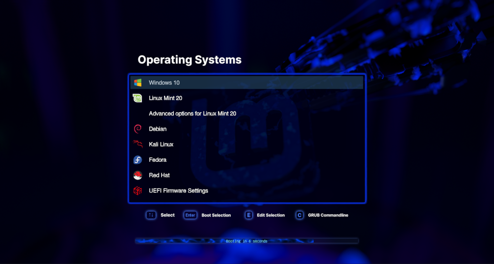

# Blue Linux Mint - Grub theme #  
### Designed for 1920x1080 Resolution ###  
### Created by @texxasrulez ###  

### Latest Screenshot ###

### Included Icons ###

| Operating System & Logo																| Operating System & Logo																| Operating System & Logo																	| Operating System & Logo																		|
|:---																					|:---																					|:---																						|:---																							|
| Alt Linux 		| FreeBSD 			| OpenMandrivia 	| Ubuntu 					|
| Android 			| Frugalware 	| OpenSuse 			| Ubuntu Gnome 		|
| Antergos 		| Gentoo 			| PC-BSD 				| Ubuntu Gnome Alt |
| Antix 				| GhostBSD  		| PCLinuxOS 			| Ubuntu Kylin 		|
| Apricity 		| Haiku 				| PhoenixOS  		| Ubuntu Mate 			|
| Arch Linux 			| Hardware Test 	| Pop OS  				| UEFI 						|
| Arco Linux 	| Kali Linux 			| Puppy Linux 			| Unknown 					|
| Boot CD 			| Korora 			| RedHat 				| Windows 					|
| CentOS 				| Kubuntu 			| Refind 				| Xubuntu 					|
| Chakra 			| Legacy 			| RemixOS 				| Zorin 						|
| Chrome 			| Linux  			| System Restart 		|																								|
| Clover 			| Linux Mint 	| Rosa 					|																								|
| Core 				| Lubuntu 			| Sabayon 				|																								|
| Crunchbang 	| Mac 					| System Shutdown 	|																								|
| Debian 			| Mac Alt 			| Siduction 			|																								| 
| Deepin 			| Mageia 			| Slackware 			|																								|
| Edubuntu 		| Mandrivia 		| Solus 					|																								|
| Elementary 	| Manjaro 			| Sparky 				|																								|
| Endeavour OS | MXLinux 			| Steam 					|																								|
| Endless OS 	| Neon 				| Submenu Icon 		|																								|
| Fatdog 			| Network 			| Suse 					|																								|
| Fedora 			| OpenBSD 			| Tails Linux 			|																								|

**Installation**  

**Installation**  
run `sudo bash install.sh`

This will copy files to /usr/share/grub/themes, backup current grub config then it will edit grub.cfg and execute  
update-grub / grub-mkconfig to make "Blue Linux Mint" your default Grub2 Bootloader Theme.  

Upon next reboot, Blue Linux Mint will be your boot screen.  

**USE at your OWN Risk!**  

:moneybag: **Donations** :moneybag:

If you use this theme and would like to show your appreciation by buying me a cup of coffee, I surely would appreciate it.  
A regular cup of Joe is sufficient, but a Starbucks Coffee would be better ...  
Zelle (Zelle is integrated within many major banks Mobile Apps by default) - Just send to texxasrulez at yahoo dot com  
No Zelle in your banks mobile app, no problem, just click [Paypal](https://paypal.me/texxasrulez?locale.x=en_US) and I can make a Starbucks run ...

I appreciate the interest in this theme and wish nothing but the best for all ...  
